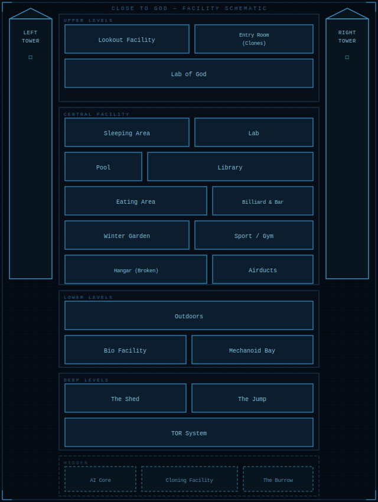

# Close to God

## Overview

- Teaser
- Introduction
- Mechanics
- Map
- Central Facility
- Lower Levels
- Side Towers
- Upper Levels
- Hidden
- Deep Levels

## Teaser

You see red snow falling. Lightning rages as it strikes a distant Finger of Stone that reaches into the Strom filled sky. Visions of falling, blood and madness.

You wake up.
"Good morning, I hope you slept well." A robotic voice tells you.
A red eye looks at you from a camera as you get up.
"Oh looks like you had a nightmare, oh dear. I told you, that while reading horror stories might be very thrilling and adventerous, they might harm your mental state, especially at night. And its important to keep your mind healthy in our luxurious home. After all this is not a nightmare."

🧠 Core Themes
	• Isolation
	• Loss of identity
	• Surveillance
	• Temporal disorientation
	• Artificial paradise masking a nightmare
	• The fear of being replaceable
The horror of eternity

	• Basic Idea
		○ The players wake up in stormy station in the middle of clouds on a huge mountain
		○ They dont know how they got here
		○ A Personal Helper A la HAL keeps the station running
			§ repair jobs
			§ Making meals
			§ Cleaning 
			§ Waste management
		○ The players have visions of violence
		○ The players have to get rid of their implants and escape the station

## Introduction

• Project Olympia:
• Log 3129184029403265739

System control initiated
authorization verified
Body synthesis sequence begin
Genetic template selected
biosynthesis laboratory systems online
cellular structure formation commenced
tissue and organ development engaged
Body formation complete
Structural integrity check verified
skeletal and muscular systems confirmed
vital organ functionality evaluated and confirmed
Consciousness upload sequence begin
Neural network mapping initiated
consciousness digitization active
memory core integration aligned
Neural link establishment
Neural transfer protocol initiated
data transfer to biological neural network monitored
consciousness synchronization monitored
Consciousness upload complete
Cognitive function test verified
sensory systems confirmed
motor function test confirmed
User creation and upload successful
Final systems check completed
comprehensive diagnostic report generated
all systems function within safe limits

## Mechanics

### 🌩️ The Eternal Storm & the Mountain Facility
The entire story takes place in a massive luxury complex built on top of a mountain, surrounded by an endless snowstorm and constant lightning. The storm is not natural — it is the facility's power source. Two energy towers harvest lightning to generate infinite electricity.
The previous owner, known only as "God", discovered how to convert energy into matter. This breakthrough made the facility self‑sustaining and effectively immortal.
Because the storm never ends and the facility never shuts down, time has lost all meaning.

### 🧬 Cloning & Identity Horror
Whenever a player dies:
	• They respawn in a completely new body.
	• Gender, appearance, and skills may change.
	• Their memories remain intact.
	• They gain 3 Stress from the trauma of rebirth.
This means:
	• Identity becomes unstable.
	• The players question whether they are the "real" version.
	• They may encounter remnants of older clones.
	• The facility treats them as replaceable data, not people.
The cloning facility is hidden deep within the structure.

### ❄️ Environmental & Psychological Horror
The world outside is lethal:
	• The snowstorm kills slowly.
	• Lightning strikes constantly.
	• The bridge on the south side is broken — crossing requires a dangerous jump.
Even if players succeed:
	• A brain‑chip triggers.
	• They lose consciousness.
	• They fall.
	• They are cloned again.
Inside the facility, hallucinations occur:
	• Blood, shadows, and impossible visions.
	• Memories from past clones bleeding through.
	• Rooms that feel subtly wrong.
	• Time behaving inconsistently.

### 🕰️ Temporal Horror
The players wake up with no memory of how they arrived. They assume it's the near future.
Later, they learn the truth:
	• The current year is 607,421.
	• The facility has been running for hundreds of thousands of years.
	• They may have died and respawned countless times before the session even begins.
This creates deep existential dread: How long have they been here? How many times have they lived and died?

### 🤖 AI Surveillance & Night Robots
A friendly, overly cheerful AI manages the luxury home. It:
	• Watches everything through cameras.
	• Speaks in a comforting but patronizing tone.
	• Insists the players stay inside "for their safety."
	• Lies about the outside world.
At night, maintenance robots roam the halls:
	• Repairing damage
	• Resetting rooms
	• Removing evidence
	• Blocking access to forbidden areas
They are not hostile, but they enforce rules with cold efficiency.

## Map

## Central Facility

| Location | General Description | Hallucinations | Connections | Secret Pathways | Access | Findings / Clues |
|---|---|---|---|---|---|---|
| Billiard & Bar | Relaxation room with soft music. | Billiard ball rolling; wrong reflection. | Pool, Eating Area, Sport / Gym, Hangar | Vent shafts | – | "Check the Shed." |
| Eating Area | Perfectly arranged cafeteria. | Cutlery clatter; table set for strangers. | Sleeping Area, Lab, Pool, Billiard & Bar, Library, Winter Garden, Sport / Gym, Hangar | Airducts | – | Tray with player's name in wrong handwriting. |
| Hangar | Large empty bay with dead machinery. | Ship taking off then glitching. | Billiard & Bar, Sport / Gym, Outdoors | Left Tower | Hole in wall | Blueprint of Mechanoid Bay. |
| Lab | Bright medical research space. | Hearing their own screams; silhouette on table. | Pool, Library, Eating Area | Right Tower | – | Iteration logs; Corrupted cloning file |
| Library | Quiet archive of books and data. | Whispering books; pages flipping. | Sleeping Area, Lab, Eating Area, Winter Garden | Entry Room, Burrow | – | Torn page on Lab of God; Tower map fragment |
| Pool | Warm, echoing indoor pool. | Floating figure; water turning red. | Eating Area, Billiard & Bar | Burrow, Airducts, Bio Facility | – | Tablet: "Don't trust the night machines." |
| Sleeping Area | Sterile luxury bedrooms where players awaken. | Seeing themselves asleep; red snow; shadow at bed's foot. | Lab, Library | Airducts | – | "You've been here before." Maintenance schedule. |
| Sport / Gym | Clean exercise area. | Heavy breathing; equipment moving. | Winter Garden, Eating Area, Billiard & Bar, Hangar | Burrow, Airducts | – | Locker with unfamiliar clothes. |
| Winter Garden | Indoor greenhouse with artificial sun. | Plants whispering; figure walking. | Library, Eating Area, Sport / Gym | Cloning Facility | – | Dead plant tagged "Experiment 47 — Failed." |

## Lower Levels

| Location | General Description | Hallucinations | Connections | Secret Pathways | Access | Findings / Clues |
|---|---|---|---|---|---|---|
| Bio Facility | Organic research labs with sealed chambers. | Breathing behind glass; hazmat figure. | Outdoors | Tunnel → Mechanoid Bay | Closed (kickable) | Clone degradation notes; "Shed — emergency access." |
| Mechanoid Bay | Robot workshop full of parts. | Robots twitching; metal footsteps. | Outdoors | Airduct → Bio Facility | Opens at night | Robot arm with TOR keycard; "Night Mode escalation." |
| Outdoors | Storm‑blasted courtyard. | Figures in storm; frozen lightning. | Hangar, Bio Facility, Mechanoid Bay, The Shed | Left Tower | – | Footprints ending abruptly; Torn warning sign |

## Side Towers

| Location | General Description | Hallucinations | Connections | Secret Pathways | Access | Findings / Clues |
|---|---|---|---|---|---|---|
| Left Tower | Lightning‑harvesting spire. | Static forming words; silhouette in lightning. | – | Outdoors, Hangar | Needs access to Outside | Storm is artificial (schematic).; A terminal display, cracked but running. Current date: Year 6,607,604. |
| Right Tower | Unstable power tower. | Tower breathing; figure climbing inside. | – | Lab | Hidden | "Matter conversion unstable — do not overload." |

## Upper Levels

| Location | General Description | Hallucinations | Connections | Secret Pathways | Access | Findings / Clues |
|---|---|---|---|---|---|---|
| Entry Room | Where new bodies awaken. | Multiple versions waking; voice saying "Again." | Lookout Facility | – | – | Clone iteration list; Malfunctioning pod |
| Lab of God | Chaotic private lab of the previous owner. | Owner speaking; self in lab coat. | Lookout Facility | Hatch → AI Core | Needs both tower keycards | Matter conversion notes; Timeline year 607,421; "You are the last." |
| Lookout Facility | Panoramic view of storm and towers. | Figures in towers; impossible landscape. | Entry Room, Lab of God | – | – | Telescope log: "Tower 7 collapse." |

## Hidden

| Location | General Description | Hallucinations | Connections | Secret Pathways | Access | Findings / Clues |
|---|---|---|---|---|---|---|
| AI Core | Organic‑mechanical heart of the system. | AI speaking in player's voice. | Cloning Facility | Cloning Facility | Hidden | Logs of all clone iterations; Storm creation record |
| Airducts | – | Crawling sounds; breathing behind them. | – | Sleeping Area, Pool, Eating Area, Sport | Must be found | Scratched arrows: "UP" / "DON'T LOOK BACK." |
| Cloning Facility | Rows of humming pods. | Past selves staring; infinite versions. | – | Entry Room, Winter Garden, AI Core | Needs Lab of God code | List of all deaths; "Stop trying to escape." |
| The Burrow | Cramped hideout dug by a past self. | Hearing themselves whisper. | – | Library | Hidden | Carved messages; Recording from past self; Escape map |

## Deep Levels

| Location | General Description | Hallucinations | Connections | Secret Pathways | Access | Findings / Clues |
|---|---|---|---|---|---|---|
| The End | The final chamber. No way back. | All previous rooms at once; voices from every body they've been. | The Jump | – | – | A door that opens inward. |
| The Jump | Deep vertical shaft. | Endless falling; impact sounds. | TOR System | – | – | Rope fibers; "Only jump if you remember." |
| The Shed | Isolated maintenance room. | Past self hiding; frantic scratching. | Outdoors, TOR System | – | – | Journal from past self; Crude map |
| TOR System | Industrial exit mechanism. | Dissolving in storm; whisper: "You've done this before." | The Shed, The Jump | – | Needs Summit keycard | "Unauthorized exit triggers failsafe." |

